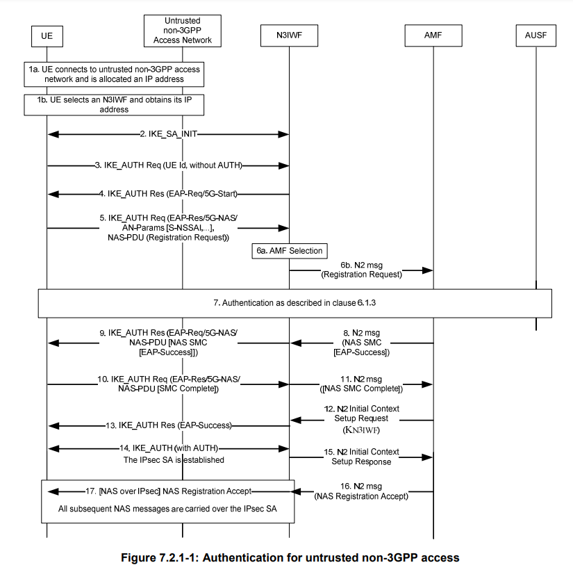
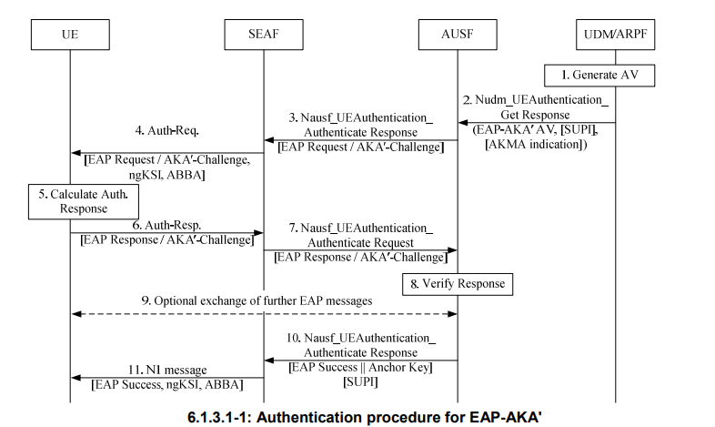
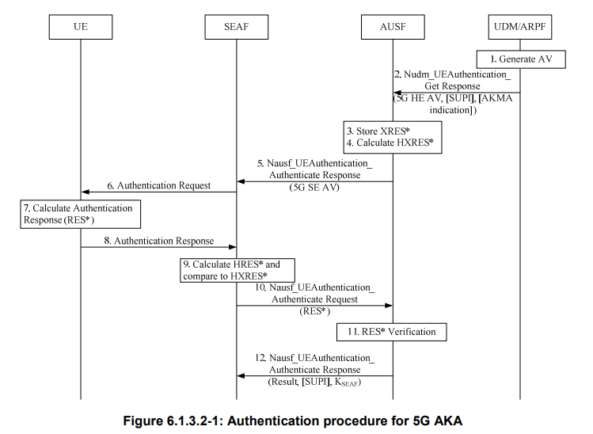
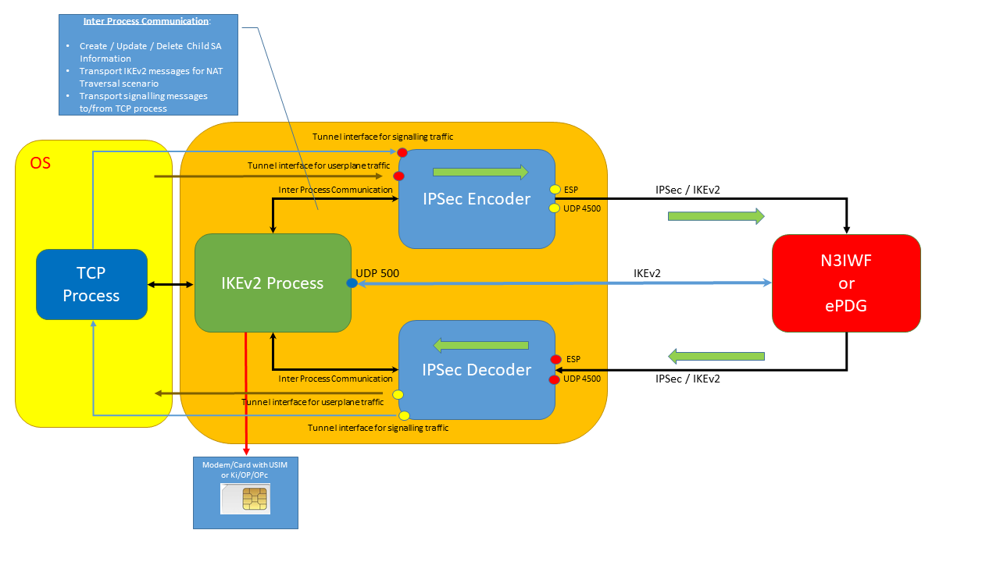

# NWu-Non3GPP-5GC client
NWu IKEv2/IPSec Client Dialer for 5GC-N3IWF

This is a NWu and SWu client emulator done in python3 that establishes an IKEv2/IPSec tunnel(s) with N3IWF or ePDG.
This application implements not only the control plane of NWu and SWu (IKEv2 and first SA child (for NWu)) but also the user plane (IPSec).

To interact with a real N3IWF or ePDG you need to get credentials from the USIM to derive the keys needed for 5G-AKA, EAP-AKA' or EAP-AKA, so once again you need to have a modem that supports the AT command AT+CSIM, or a SmartCard reader, or even through an https server (see https://github.com/fasferraz/USIM-https-server).

Note: If no Modem/SmartCard Reader/HTTPS Server then a default CK, IK and RES will be used (check corresponding variables inside the code)

For authentication the application also accepts Ki and OP/OPC for Milenage operation (usefull for testing with developments like open5gs or free5gc, where the USIM parameters are defined in the HSS/UDR).


NWu is the interface between UE and the N3IWF as defined by the 3GPP, and is an IKEv2 based protocol with some minor modifications that can be found in 3GPP 33.501, 24.501 and 24.502. The IKEv2 control plane is used to help perform authentication, establish SA Child, either the signalling SA Child or the User Plane SA Child.

This application can use any network type (Wifi, Fixed, Mobile) to establish an IKEv2 Tunnel towards the N3IWF or ePDG and can be used in a more broader way than just the VoWifi scenario, since any DDN/APN can be requested. 
The applications outputs every single KEY and parameter used in the IKEv2 and IPSec processes, which allow us to decode the corresponding traces in wireshark if needed. 


This applications supports currently the following RFCs and options:
- IKEv2 RFC 5996 / RFC 7296
- EAP-AKA Authentication RFC 4187
- EAP-AKA' Authentication RFC 5448
- IKEv2 Encryption: AES-CBC-128 and AES-CBC-256 and NULL
- IKEv2 Pseudo Random Function: PRF-HMAC-MD5, PRF-HMAC-SHA1, PRF-HMAC-SHA2-256, PRF-HMAC-SHA2-384 and PRF-HMAC-SHA2-512
- IKEv2 Integrity: HMAC-MD5-96, HMAC-SHA1-96, HMAC-SHA2-256-128, HMAC-SHA2-384-192 and HMAC-SHA2-512-256
- Diffie-Hellman Group: 1, 2, 5, 14, 15, 16, 17 and 18 
- IPSec Encryption: AES-CBC-128, AES-CBC-256, AES-GCM-8, AES-CGM-12, AES-GCM-16 and NULL
- No Certificates
- NAT-T Detection
- IKEv2 over UDP port 500 or 4500
- IPSec over ESP or UDP port 4500
- Fast-Reauthentication (currently only supported for SWu)
- IKE and IPSec Rekeying (currently ony supported for SWu)
- 5G-AKA or EAP-AKA' authentication methods with N3IWF for 5G

https://www.iana.org/assignments/ikev2-parameters/ikev2-parameters.xhtml#ikev2-parameters-6

The next picture shows the authentication flow for non-3GPP access in 5G:

<p align="center"></p>


There are two methods for authentication:

- EAP-AKA':

<p align="center"></p>


or 
- 5G-AKA:

<p align="center"></p>


----

The application has 4 distinct processes:
- Main process that handles the IKEv2 flow states
- After establishing the initial SA Child for IPSec (signalling SA Child for NWu or user plane SA child for SWu) three additional processes are created to handle the IPSec Encryption/Decryption:
- IPSec Encoder: 
    - Gets user data from tunnel interface, encrypts and sends it to N3IWF/ePDG
    - Receives info from main process to create/update/delete SA Child
- IPSec Decoder:
    - Gets encrypted data from N3IWF/ePDG, decrypts it and sends it to the tunnel interface
    - Sends decrypted IKEv2 message to main process (with NAT Traversal since IKEv2 messages are also received in UDP port 4500)
- TCP process:
    - Send and receive NAS messages to/from N3IWF, transfered through the signalling SA child
    - Send and receive NAS messages to/from Main process
   

The next picture shows an high-level description of this:

<p align="center"></p>


These are the required modules needed for python3 in order to be able to run the application:

```
import serial
import struct
import socket
import random
import time
import select
import sys
import os
import fcntl
import subprocess
import multiprocessing
import requests

from optparse import OptionParser
from binascii import hexlify, unhexlify

from cryptography.hazmat.backends import default_backend
from cryptography.hazmat.primitives.asymmetric import dh
from cryptography.hazmat.primitives import hashes, hmac
from cryptography.hazmat.primitives.ciphers import Cipher, algorithms, modes

from Crypto.Cipher import AES
from cryptography.hazmat.primitives.ciphers.aead import AESGCM

from smartcard.System import readers
from smartcard.util import toHexString,toBytes

from card.USIM import *

from CryptoMobile.Milenage import Milenage

from gNAS import *
from gSECURITY import *
```
Note: I added the card.USIM module because it handles much better blank USIM cards bought in eBay or AliExprees, than my old USIM interaction functions.


These are the options currently available when starting the app:

```
root@ubuntu# python3 nwu_emulator.py -h
Usage: nwu_emulator.py [options]

Options:
  -h, --help            show this help message and exit
  -m MODEM, --modem=MODEM
                        modem port (i.e. COMX, or /dev/ttyUSBX), smartcard
                        reader index (0, 1, 2, ...), or server for https
  -s SOURCE_ADDR, --source=SOURCE_ADDR
                        IP address of source interface used for IKE/IPSEC
  -d DESTINATION_ADDR, --dest=DESTINATION_ADDR
                        ip address or fqdn of ePDG
  -a APN, --apn=APN     APN to use
  -g GATEWAY_IP_ADDRESS, --gateway_ip_address=GATEWAY_IP_ADDRESS
                        gateway IP address
  -I IMSI, --imsi=IMSI  IMSI
  -E IMEI, --imei=IMEI  IMEI
  -M MCC, --mcc=MCC     MCC of ePDG (3 digits)
  -N MNC, --mnc=MNC     MNC of ePDG (3 digits)
  -K KI, --ki=KI        ki for Milenage (if not using option -m)
  -P OP, --op=OP        op for Milenage (if not using option -m)
  -C OPC, --opc=OPC     opc for Milenage (if not using option -m)
  -T INTERFACE_TYPE, --type=INTERFACE_TYPE
                        SWU or NWU interface. (By default is NWU)
  -F, --free5gc-core    if using non compliant R16 free5gc N3IWF
  -u FREE5GC_USERPLANE_IP_ADDRESS, --userplane-ip-address=FREE5GC_USERPLANE_IP_ADDRESS
                        userplane IP address (for non compliant free5gc N3IWF)

```


The option -F is used when using this application with Free5GC 5G Core.
There are some bugs in free5GC, and I needed to adapt to those bugs to make my application work. 
This was needed, since this was the only open 5G Core I know with N3IWF implementation.

Nevertheless, I implemented the app to comply with R16 standards, althoug I never test it against a N3IWF fully compliant.

Some free5GC issues:
-------------------

- Does not send the PDU Session Establishment Accept to the UE through signaling SA child. Only creates the userplane SA child. That means that we must figure out what will be the session IP. Usingo free5gc defaults, that address is 60.60.0.1. But i added option -u so that we can set the session IP in order to create the tunnel for user plane sesion correctly.
- The GRE implementation does not comply with 3GPP requirements (4 bytes instead of 8 bytes with RQI)
- The NAS messages should be prefixed with 2 bytes with NAS lengh information, but in free5GC NAS messages are carried directly in the TCP connection
- AN parameter "requested NSSAI" is not correctly formated
- EAP-AKA' authentication not complete (in AMF), and several erronous checks (in AUSF when comparing RES with XRES, wrong padding in RES processing, KSEAF calculated based on empty KAUSF key)
- EAP-AKA' packets do not have the subtype byte (e.g. AKA-Challenge, etc...) and the following 2 reserved bytes (3 bytes in total)
- Integrity and Ciphering functions in AMF are using Bearer ID for 3GPP access, instead of non-3GPP access as stated in 33.501

------------

Example with EAP-AKA' Authentication (I needed to change several files in free5GC to make it work...):

```
root@ubuntu:/home/fabricio# python3 nwu_emulator.py  -a internet -d 172.16.62.131 -M 208 -N 93 -I 208930000000003 -K 8baf473f2f8fd09487cccbd7097c6862  -P 8e27b6af0e692e750f32667a3b14605d   -s 172.16.62.130 -F
INTERFACE_TYPE 1

STATE 1:
-------
NAT SOURCE 854046b0c728ce20cc492ef5c1bf8072cb56d7df
NAT DESTINATION e45afe1d291c4cf5c5a9ae263e08f62400dbeeed
sending IKE_SA_INIT

Received IKE message decoded:
[[33, [1, 1, b'', b'\x00\x00\x00,\x01\x01\x00\x04\x03\x00\x00\x0c\x01\x00\x00\x0c\x80\x0e\x00\x80\x03\x00\x00\x08\x02\x00\x00\x02\x03\x00\x00\x08\x03\x00\x00\x02\x00\x00\x00\x08\x04\x00\x00\x0e']], [34, [14, b'\xb1QQq5\x81\x97pr\x088[\xaf\x12\'\xf0T\xf8\xb20)\xa1Oh#HE\xa2A\xebg\xf4\x19\xbc\xd7\xe88\xb9~g\xca\x81\\\xdcU \xecQE*x\xa1I\xc4\xc1\xcd\x89@F\x8a\x8e#\x9b\xdb\xa2\xba"N\xd2\x17WZ\xc10)\xf1 \xf3S\x17\x83\xf3\xeb\xffJ\xadT\xcb\x15\r\xdcMBU\xd2\xe8b\x7f\x9b\xa6\xe8G+\xda\x90\x19&\\h\xc8\xee\x96~n\xf9\x00i\x08]\xfenytK\x8bhu9\xf9\xe3\xdb]\'4\'\xdf\x19\xdf\xa16\x95A1m\x84\xb6E\xc8}\xd4\x8bB\x95\xf4% \x87\xfd\xda*\x8e\x81+@\xcc\xdc_\xeej\xf5\x11\xe1\x13n\xc6\xb2i\xe5\xd2\xbf6\xc5"q%E\xb9|\xb4z\xbd\x0e\xa8E\xc8\xab\xdb\xab\xf2\x8ccl\x1c\x06\xed\xe1\x80\x8a\xce\x19\x12K\xcc3z|@\x93?N\xea\xdb>\x05\x13\xb6\xe2KkK\x05\x07\x8b?\x06m?,a\r\xd28,\x05\xbb\x9d\xe9g\x93\xf6|F\xf1\xf4\x92D']], [40, [b'\xb8\xef&E\xda{_a\x94\xabKj\xfd\xd0\xd9\x80\x86\xc5c\xfc5mK|mLJ\xae\x0cuO\xa3\x07m\x7f\x82h}C\xee\xbc\xef\xfb\xe9\x8f\xc1S\xa1\xcfC\xdcGw\x9c\xb3\x93\x0f\xda\xfcv\xa2\x04\xca[\x112v\x9a\xcc4~x\xbc\xa1z\xeb\xb9P\xec\xd7o\xed`&\x08<\t\xd3O\xf5\xf5J\xf0\xf9\xaf\x14Q\xc0\xc3\x98\x92\xf2L+yM^\xe2\xd6r\xd30\xed\x1bb\x9a\xea&A\x89\x88<\x84\x1c5\x8ac\xf9\xf8f\xbf(\x07\x0c\x828\xdcX\xc6[\xea\xa9\xdd&z_\x17\x06>\xc3|q\xd0\xeb\xc7G\x9c\xea\x17W?`\x08\xa9\xb4\x94\xa3\xf5\x8c\xc31\xe7\xb1\xc4\x9b\xa9\xa1\x9e\xa4\xde<KQ\xe4HH\xc38\xaf&^\xf4\xff>\xaann\x7f\x08\x8bV\x05\xc7\xbfz\xb7HP\xe8\xa4?\xd6\xc6\xd9\x01\xe2DW\x97\xa3\x01\x0e\x13~\xcc\xda1B\xe6\x91\xe9y\xb4\xeaa\xaa\x9aZ\xb1\x9c \xbd\xe3\xa1Mm\xf2<&\x16\x84\xc9\x07\xaa\xaaZ']], [41, [0, 16388, b'', b'\xca\x18\xf0c\xcd\xf2\x94\xbb\xe4\xf3E\xac\x85\xa6~\x05\xac\x10>\x83\x01\xf4']], [41, [0, 16389, b'', b'\xca\x18\xf0c\xcd\xf2\x94\xbb\xe4\xf3E\xac\x85\xa6~\x05\xac\x10>\x82\x01\xf4']]]
received IKE_SA_INIT
DIFFIE-HELLMAN KEY 522ccd9e8c83c95c6dba80fb857f9c49a460930462bba4aa7664169b117e65bd520788a9db3a43cfe045f75d996d75ca3d010ea2c475156744ac815941a5745067b64736a9ea12583fd3c460bdf5a58c7a3025eecfda07389560c265dec6bf1ec6b16257e4ca2d763e7f6bd31c5d38afa1d0284a1acaade6b21048d444ee2ec1fdae179d939ee43d291b31fc08da2fb1fa9d5e1c568ec98c689b8032be90abbcd6a213c35dcac7a363680bf94ab160f36c93f8f895688a00a9af5aa6fc90e5c176dba6469eaa8d638560238c7bad6c8a1cbc30a79aba34622528737ceec148d8fd627254ca61e97a6cfcc04dbe6dcfa4773c7f894be3917be146b231c019b339
NAT SOURCE RECEIVED ca18f063cdf294bbe4f345ac85a67e05ac103e8301f4
NAT SOURCE CALCULATED b4039caa7997221a839cdfa79b80ca205ccccfe8
NAT DESTINATION RECEIVED ca18f063cdf294bbe4f345ac85a67e05ac103e8201f4
NAT DESTINATION CALCULATED e5769b1d0ff2d36ebf7a2ebdf422306652ce29eb
SKEYSEED ea148f52ae1ec3913200ff383ca476cbc9c9a5b4
STREAM 4a4c049e1d63537123b5a7f8e999ec87b8ef2645da7b5f6194ab4b6afdd0d98086c563fc356d4b7c6d4c4aae0c754fa3076d7f82687d43eebceffbe98fc153a1cf43dc47779cb3930fdafc76a204ca5b1132769acc347e78bca17aebb950ecd76fed6026083c09d34ff5f54af0f9af1451c0c39892f24c2b794d5ee2d672d330ed1b629aea264189883c841c358a63f9f866bf28070c8238dc58c65beaa9dd267a5f17063ec37c71d0ebc7479cea17573f6008a9b494a3f58cc331e7b1c49ba9a19ea4de3c4b51e44848c338af265ef4ff3eaa6e6e7f088b5605c7bf7ab74850e8a43fd6c6d901e2445797a3010e137eccda3142e691e979b4ea61aa9a5ab19c20bde3a14d6df23c261684c907aaaa5aca18f063cdf294bbe4f345ac85a67e05
SK_D b9f68333219ff0ed4a6ac382b9b5ecc4eb6bb738
SK_AI 52f6bdb5c29422c101760e5638f2aa4ab480a5f0
SK_AR 43f6469d239ea17f745c159248558bea067a2cb5
SK_EI fcd5263e5890bb19d7fbea47e9571ccc
SK_ER c3cb8e406ac4acb331c8e55d1197c226
SK_PI ce7c55e3f2049d0b790ef01ba6eeef1d4cc1ed56
SK_PR fae19eb5ffe2d2f4cfc462603802407b0c425ce6
IKE SPI INITIATOR ca18f063cdf294bb
IKE SPI RESPONDER e4f345ac85a67e05

STATE 2:
-------
sending IKE_AUTH (1)
EAP 01bf000efe0028af000000030100

Received IKE message decoded:
[[46, [[36, [2, b'n3iwf.free5gc.org']], [37, [4, b'0\x82\x03\xf90\x82\x02\xe1\xa0\x03\x02\x01\x02\x02\x14\x0b\xabB\xd3f\xbd\xbb\xc3\xd4\x80\xeb\xb5\xb1"\xf5\x11\xf4\xba\xe4\x050\r\x06\t*\x86H\x86\xf7\r\x01\x01\x0b\x05\x000\x81\x9c1\x0b0\t\x06\x03U\x04\x06\x13\x02TW1\x0f0\r\x06\x03U\x04\x08\x0c\x06Taiwan1\x0f0\r\x06\x03U\x04\x07\x0c\x06Taipei1\x100\x0e\x06\x03U\x04\n\x0c\x07WireLab1\x110\x0f\x06\x03U\x04\x0b\x0c\x08Wireless1*0(\x06\t*\x86H\x86\xf7\r\x01\t\x01\x16\x1bwirelab@wire.cs.nctu.edu.tw1\x1a0\x18\x06\x03U\x04\x03\x0c\x11n3iwf.free5gc.org0\x1e\x17\r200329114305Z\x17\r300327114305Z0\x81\x9c1\x0b0\t\x06\x03U\x04\x06\x13\x02TW1\x0f0\r\x06\x03U\x04\x08\x0c\x06Taiwan1\x0f0\r\x06\x03U\x04\x07\x0c\x06Taipei1\x100\x0e\x06\x03U\x04\n\x0c\x07WireLab1\x110\x0f\x06\x03U\x04\x0b\x0c\x08Wireless1*0(\x06\t*\x86H\x86\xf7\r\x01\t\x01\x16\x1bwirelab@wire.cs.nctu.edu.tw1\x1a0\x18\x06\x03U\x04\x03\x0c\x11n3iwf.free5gc.org0\x82\x01"0\r\x06\t*\x86H\x86\xf7\r\x01\x01\x01\x05\x00\x03\x82\x01\x0f\x000\x82\x01\n\x02\x82\x01\x01\x00\xc3\x90\x81\x13\xdf[\x97o<\xf7\xf2\xde\xb9\x0b\x92\xc7o\xdc%\x17\xc2UY\xd8\xdb\xfd\x84\x13\xdc]k\x9a\xfe\x16xs\x03\x1d\xad\xde\xc8\x8f\x8a\xef2c\x9cA"a\x0b\xa6\xbe\xfaOF\xf7o\xca\t\xd9\x82\xdf1 `Er\x9fq\x85|\xfa\xf5\xfd1\x8f\xa1t\xd3\xf8\x00\x8an\xb2\xbd\x8a\xf9\x92\xa5Hot\x8fM\xe6A\xd4\x18\x08\xd7/\xc5m\x80V;\xd6N)\xccU\x8c*\xee#\x97\xf4\'\xc5\xd5\'\x01a\x02\xa2\x0f\x1d8\xc7\x88\xf7\xd7.^\xa99\xeb#A\xd5\x94"\x00\x99\x00\xca}8\xf27+\x91pT&\xbf\xd2\xbd\xd4\xb2\'\xef\x12\xad\xfc25\x8cF\x83p`\x96Y\x1f\\i\x0b\x1a\xa1\xafX\xdb2\xc6c\x04\r\x82A\xf6\x8f\x7f\r\x86\xb2C\x17\x1a\x8c\xdf1\xaczV\x14\x1c\xcc\x15RX\x9c\xbd\xee\x8e\x8c\xc3\xda\x1a/W$4v\x9c\\\xfbN4=\x85+\xac\x18:\xd5\x0c\xb5|\xc0\x1b\xa6HN\xd2\x1e\xf0\xad\x80f&\xb8\x88\x04\t\x02\x03\x01\x00\x01\xa310/0\x1c\x06\x03U\x1d\x11\x04\x150\x13\x82\x11n3iwf.free5gc.org0\x0f\x06\x03U\x1d\x13\x04\x080\x06\x01\x01\xff\x02\x01\x000\r\x06\t*\x86H\x86\xf7\r\x01\x01\x0b\x05\x00\x03\x82\x01\x01\x00Q\xa2\xdd\x04\r\x02\xcdK\xb2W\xcd\xb6\x8e\x83d\x01M\xcd\x14\xda2|\x15\x94#\xf8\xfb\xa1f\xf4Z\xcb\x02`\x0b\x06jqf2\xaa\x90#<\xa8\xa8\xa8\xd3\xea\x08\xefb\x04\x87\xa9]5[\x8e\xaag\xdb\xbf\xf6\xa7\x9e\xa8T\xb7\xc2\xf0\x1a^\xbdj\xed\x16\xfc\xcc\xa9\xdaFa\xf3u\xd4\xa3\xe0\xc9\xba\xc1\xf6\xf5\xf8\xcf%\x8e\x13\x11\x0b-\xc4k\xc2\x1d\x1bql\xb0\xff\x95\xe8\x01\xd6j$\x89G\x0bIY&\x11\x8aJC.\xba\xdc\x06\x8a\xcdt\x18\xbf1\xad~\xb0\xa6\x1c\\\xd4.\x83\xd3\xb9\xd9\xd0p\x1fs@\xacD\xc4\x13\xe9\x95x\x8e\x83yO\xbc\xd7fO"\x177\xecb\x12\x92\x9b=\xe8A\xaf/R\xfd}\x85\xf3\xc7\x9b\xb4\x89\x0c\xa9X\xca=\x15C1\xa7\x8e\xb9\xf0m\xca\n\x93h\x1d\x90\x9f)\xde\xa3Z\xd7+\xb2n\xc7\xcf\xae\xf7\xd2.Y\x80\x8b\x95\x80\x83?\x05\x85\x12\xe6\xb7\x90q`=\x1b\x95\x81y\xe7au\xbbv\xad\xaf\xa23JqV']], [39, [1, b'(\x90\x13@I\x15\xf2\xc3\xd16\x1f\xc5s\x8a\x1a+\x96l9]\xdd\x92\xac\xf2\x7f\x83\x8c\xdc{\xe5\xa2\\T$\xe3o\x18\xdaw<;\xc6\xce\xaa\x05O\x10\xee\x0c\x0f\x1d\xcf\x85l\xc2\xe4q\x83\xd75\xb8]qK\xc0\x8fQ\xec\x80\xc9}\xb3k\xdf\x0c\x91\xe8\xb1\x0c\xd6\x11#l#\r\xe9\x8f\xea9\x87\x90\x93\xad\xf8\xdb.\xa1h\xfe\x07\xab0&\xdc\x08X\x17\x99\xdb\x1c\x06\xbe\xe4\xe0\xf2Q\x03\xdc}H\xae[A\x05\xed\xa5I\x9e\xbfGb#\x89\xd4\x83\xa1\xa0\xf2\x08\xe8\x0e\xa2 \xfd\xfew0\xc2\xe0(\xf2\xbakM\x10\x99\xc3\xecT\xe0v\xc6\xb4s\xa3@\x90>\xda\xf9\xc85j\x1d\x91\x9aH-,n\xbfi\xff\xdb\x82\x08H)\x1e)\xcc1.lU\xac\x8a{`\xdb\x86\xadip\x89\x94{\x9dBU\x83\r.\xd9\x99\xea\x1a)+\xf3\xf7\x85\xdf\xb5\xa2N\xee\xaa`\xb0\x13\xa7\x99\n\xd7V\xf6\x93\xe1\x08 tB\xa6\x15\xa4\xddL$\x1f\x050\xd5\xe2\x98~']], [48, [1, 191, 254, b'\xfe\x00(\xaf\x00\x00\x00\x03', [10415, 3, 1]]]]]]
received IKE_AUTH (1)

STATE 3:
-------
sending IKE_SA_AUTH (2)
EAP 01420083fe0028af00000003020000737e005600020000780069014400693201050000b8e57928494f1719ca64d522d0a7f6f70205000052a5ee94be8d80000b523f708f0900cd0b0500006d12c5341346c1f1ba4463f6b7de0c50180100011709002035473a6d6e633039332e6d63633230382e336770706e6574776f726b2e6f7267

Received IKE message decoded:
[[46, [[48, [1, 66, 254, b'\xfe\x00(\xaf\x00\x00\x00\x03', [10415, 3, 2, None, b'~\x00V\x00\x02\x00\x00x\x00i\x01D\x00i2\x01\x05\x00\x00\xb8\xe5y(IO\x17\x19\xcad\xd5"\xd0\xa7\xf6\xf7\x02\x05\x00\x00R\xa5\xee\x94\xbe\x8d\x80\x00\x0bR?p\x8f\t\x00\xcd\x0b\x05\x00\x00m\x12\xc54\x13F\xc1\xf1\xbaDc\xf6\xb7\xde\x0cP\x18\x01\x00\x01\x17\t\x00 5G:mnc093.mcc208.3gppnetwork.org']]]]]]
received IKE_AUTH (2)
NAS_DECODED [(1, 126), (2, 0), (3, 86), (111, 0), (112, b'\x00\x00'), (115, b'\x01D\x00i2\x01\x05\x00\x00\xb8\xe5y(IO\x17\x19\xcad\xd5"\xd0\xa7\xf6\xf7\x02\x05\x00\x00R\xa5\xee\x94\xbe\x8d\x80\x00\x0bR?p\x8f\t\x00\xcd\x0b\x05\x00\x00m\x12\xc54\x13F\xc1\xf1\xbaDc\xf6\xb7\xde\x0cP\x18\x01\x00\x01\x17\t\x00 5G:mnc093.mcc208.3gppnetwork.org')]
ABBA 0000
EAP 014400693201050000b8e57928494f1719ca64d522d0a7f6f70205000052a5ee94be8d80000b523f708f0900cd0b0500006d12c5341346c1f1ba4463f6b7de0c50180100011709002035473a6d6e633039332e6d63633230382e336770706e6574776f726b2e6f7267
NAS EAP MESSAGE [1, 68, 50, 1, [(1, b'\xb8\xe5y(IO\x17\x19\xcad\xd5"\xd0\xa7\xf6\xf7'), (2, b'R\xa5\xee\x94\xbe\x8d\x80\x00\x0bR?p\x8f\t\x00\xcd'), (11, b'm\x12\xc54\x13F\xc1\xf1\xbaDc\xf6\xb7\xde\x0cP'), (24, 1), (23, b'5G:mnc093.mcc208.3gppnetwork.org')]]
RAND b8e57928494f1719ca64d522d0a7f6f7
AUTN 52a5ee94be8d80000b523f708f0900cd
MAC 6d12c5341346c1f1ba4463f6b7de0c50
KDF 1
KDF_INPUT b'5G:mnc093.mcc208.3gppnetwork.org'
RES b59a7b2dde74fe2a
CK 911211660fefb6e1d9e7036dfdcbef31
IK 4aca874a02b849ad3c199e3b71e11357
CK' 95e8952135ebe2a6eadb13fa54f0fbf7
IK' 1f03c4bee093c54467094e722858fae3
MK d5f45eb45fd24acaee12aa9f900d23a651f718d9c1d5d260aeaddf6a918e6721e1f70d20b0d997cd0b60c30e79af3d9bfdbf89cb251cf097ba1b08fbd9ba952baabadf438cd50d83bcbd087299c30c13e7299ac4bf1b408b18f925d2a80d8f51691fb60a2532cf88a2792fcf8c461d21de90b261a7d4b4a6d5784b205a6b80983492e1851bf7954212da4fa856451cd11eeeff8d50bf682a543b8df6493cd9ce14a172137d65b5c79701f7ad30a8b9c1df9df4e3bd31b972381654f4e5b5eabc9802c7896a0f0fd70cd3ab80ce9e3c17
KENCR d5f45eb45fd24acaee12aa9f900d23a6
KAUT 51f718d9c1d5d260aeaddf6a918e6721e1f70d20b0d997cd0b60c30e79af3d9b
KRE fdbf89cb251cf097ba1b08fbd9ba952baabadf438cd50d83bcbd087299c30c13
MSK e7299ac4bf1b408b18f925d2a80d8f51691fb60a2532cf88a2792fcf8c461d21de90b261a7d4b4a6d5784b205a6b80983492e1851bf7954212da4fa856451cd1
EMSK 1eeeff8d50bf682a543b8df6493cd9ce14a172137d65b5c79701f7ad30a8b9c1df9df4e3bd31b972381654f4e5b5eabc9802c7896a0f0fd70cd3ab80ce9e3c17
KAUSF 1eeeff8d50bf682a543b8df6493cd9ce14a172137d65b5c79701f7ad30a8b9c1
KSEAF 3d072e2fb889b7a873d1b78aed8790097011afe365749039aafe9667ed793947
KAMF 3d3b8a8c50c56e61758d173755084b1ec01159616080fa55b507f5f8d0c686cb
EEA1-KEY 870ddda904eeebeee06761003612d0a0
EEA2-KEY f65286c2f2a0bc6a33fb3dedc67f7434
EEA3-KEY 17ee3cb10e96031f596cc9d3415d7ff5
EIA1-KEY 586a613ded2620c8beea70758c26d3a2
EIA2-KEY cab73183c834c2dbdb035f3ba165a07d
EIA3-KEY c9ac0ef0cca754776ec173991ea1b899

STATE 4:
-------
sending IKE_SA_AUTH (3)
EAP 011e002efe0028af000000030200001e7e03355e3a59007e005d0200028020e13601007800040344000438020000

Received IKE message decoded:
[[46, [[48, [1, 30, 254, b'\xfe\x00(\xaf\x00\x00\x00\x03', [10415, 3, 2, None, b'~\x035^:Y\x00~\x00]\x02\x00\x02\x80 \xe16\x01\x00x\x00\x04\x03D\x00\x048\x02\x00\x00']]]]]]
received IKE_AUTH (3)
NAS DECODED [(1, 126), (2, 3), (4, b'5^:Y'), (5, 0), (6, b'~\x00]\x02\x00\x02\x80 \xe16\x01\x00x\x00\x04\x03D\x00\x048\x02\x00\x00')]
NAS DECODED [(1, 126), (2, 0), (3, 93), (120, 2), (111, 0), (121, b'\x80 '), (117, 1), (118, b'\x00'), (115, b'\x03D\x00\x04'), (112, b'\x00\x00')]
MAC Received 355e3a59
MAC Calculated 355e3a59
KN3IWF f97f3ab0ee8c7523da9d5b3d0a071154150ff0f42987f1880c3d50324e38e1de
021e0028fe0028af000000030200000000167e043e2d44c5007e005e7700095534129078563412f0

STATE 5:
-------
sending IKE_SA_AUTH (4)
EAP 038e0004

Received IKE message decoded:
[[46, [[48, [3, 142]]]]]
received IKE_AUTH (4)

STATE 6:
-------
sending IKE_SA_AUTH (5)

Received IKE message decoded:
[[46, [[39, [2, b'\x06eGT\x1f(\x9c\n\x03\xfc*\xcb\x82"\xebq\x0fQ@\xa9']], [47, [2, [(1, '0.0.0.0', '0.0.0.0', '0.0.255.255', '10.0.0.157'), (2, '255.255.255.0')]]], [33, [1, 3, b'\xf5x\xe05', b'\x00\x00\x00 \x01\x03\x04\x02\xf5x\xe05\x03\x00\x00\x0c\x01\x00\x00\x0c\x80\x0e\x01\x00\x00\x00\x00\x08\x05\x00\x00\x00']], [44, [1, [(7, 0, 0, 65535, '10.0.0.157', '10.0.0.157')]]], [45, [1, [(7, 0, 0, 65535, '10.0.0.1', '10.0.0.1')]]], [41, [0, 55502, b'', b'\n\x00\x00\x01']], [41, [0, 55506, b'', b'N ']]]]]
received IKE_AUTH (5)
IPV4 ADDRESS ['0.0.0.0', '0.0.0.0', '0.0.255.255', '10.0.0.157']
TUNNEL IP FOR TCP 10.0.0.157
IPSEC RESP SPI f578e035
IPSEC INIT SPI f578e035
IPSEC PROPOSAL 1
NAS IP ADDRESS 10.0.0.1
NAS TCP PORT 20000
SK_IPSEC_AI 
SK_IPSEC_AR 
SK_IPSEC_EI 846520ca10350649fed55f4b0e5fa5be296dd6b5a3b2d6d0063671831843a8f2
SK_IPSEC_ER 794170d83d83d0dae1b314593fe6da1bd4ddfcb26207d7c9dcaa117e275ecb16

Signaling SA CHILD created. Establishing TCP session towards NAS...


STATE 7:
-------
NAS DECODED [(1, 126), (2, 2), (4, b'\xf8\xbd\x00\x01'), (5, 1), (6, b'~\x00B\x01\x02w\x00\x0b\xf2\x02\xf89\xca\xfe\x00\x00\x00\x00\x01T\x07\x00\x02\xf89\x00\x00\x01\x15\n\x04\x01\x01\x02\x03\x04\x01\x11"3]\x01I\x16\x01,')]
NAS DECODED [(1, 126), (2, 0), (3, 66), (100, b'\x02'), (101, b'\xf2\x02\xf89\xca\xfe\x00\x00\x00\x00\x01'), (103, b'\x00\x02\xf89\x00\x00\x01'), (104, b'\x04\x01\x01\x02\x03\x04\x01\x11"3'), (109, b'I'), (110, b',')]
REGISTRATION ACCEPT message received:
5G-GUTI [(40000, 2), (40001, 20893), (40002, 202), (40003, 1016), (40004, 0), (40005, b'\x00\x00\x00\x01')]
Preparing REGISTRATION COMPLETE to send...
Preparing UL NAS TRANSPORT message with container PDU SESSION ESTABLISHMENT REQUEST to send...

Received IKE message decoded:
[[46, [[33, [1, 3, b'\x13Z?\x19', b'\x00\x00\x00 \x01\x03\x04\x02\x13Z?\x19\x03\x00\x00\x0c\x01\x00\x00\x0c\x80\x0e\x01\x00\x00\x00\x00\x08\x05\x00\x00\x00']], [40, [b'\x12\xe6\xfc\xa2\xf0k\x0e \xefI\x85\xf9\xac\xca\xad\x1c\xcdX\x0e\xff&9\xa1.\xf7\x99\x16w\xbc{x\xbc\x1et<\x17\xfe\xd7\xad~\x02-\x08|\xea)\xaa\xc9M_/\xff\x9a\x85$]\xee\r\xe1\x1f\xd4\x98\x8ert-\x80V2\xae\xdd\xbd\x0b#\x81g\x0bE\x01\xe9\x91\xbdm\xe4UJ\x18r\x8b\x8cJW\x8e\xcb\xb4\x98\nKS)$\xdei\xafa5\xa3\xae\x9cT\x15\x7f}BBC\xe6,\x87\xc2{)\xafR\xf2\xa9\x8d\x10\r\x8d\xdb\x17*\x0e\x98\xcbS\xd5\x1c\x01\x14\xb5\x07l_a\xc1A\x0c^\xc4R6\xcd2\x14\x04_\xcc\x01\x95\x98\x01c\xad}\xc5\xcd\xbf\xf7\xd1S\xf4D\xbb`\xdf\xd5j\t\xad\xd1C(\xe6\xee\xb0/\xb9ui\x1eT\xe3\xa4iZ\xd35\x0c/P\x88\xf2\xdd\x96\xc6\xe1\x0f\xdf\xe8D\xbd9^V\xa1~\xd9\xc0\xc4\xab\xd9\x9a\x9e3\xd1\xc3\xd0\xb4\xa3`\x8fY\xe4\x03.\xa8\xbe\x16\x16\xca\xc7Gs\x0b\xc6\x82.7\xf0\x814\xa0\xfc\xf8']], [44, [1, [(7, 0, 0, 65535, '10.0.0.1', '10.0.0.1')]]], [45, [1, [(7, 0, 0, 65535, '10.0.0.157', '10.0.0.157')]]], [41, [0, 55501, b'', b'\x05\x05\x01\t\x02']], [41, [0, 55504, b'', b'\n\x00\x00\x01']]]]]

STATE N3IWF SENT A CREATE CHILD SA:
----------------------------------
5G QOS INFO 0505010902
UP IPV4 ADDRESS 10.0.0.1
received CREATE_CHILD_SA request IPSEC
USERPLANE CHILD SPI INITIATOR  135a3f19
USERPLANE CHILD SPI RESPONDER 135a3f19
SK_IPSEC_AI 
SK_IPSEC_AR 
SK_IPSEC_EI fa4f95d17473bce3074cff9aecb37c73814420ea2c0f3656e7f8005440fb42c7
SK_IPSEC_ER ac4ba5cb1756628cd8210a60dc336079dfed2ab3b979d8a301acfca9ce83ed03
sending CREATE_CHILD_SA response IPSEC
q
Exiting TCP process. Process terminated.
sending INFORMATIONAL (delete IKE)

```

Example with 5G-AKA Authentication:

```
root@ubuntu:/home/fabricio# python3 nwu_emulator.py  -a internet -d 172.16.62.131 -M 208 -N 93 -I 2089300007487 -K 5122250214c33e723a5dd523fc145fc0 -P c9e8763286b5b9ffbdf56e1297d0887b   -s 172.16.62.130 -F
INTERFACE_TYPE 1

STATE 1:
------- 
NAT SOURCE 954715cd38c93802b8bb33df4a2858c72d2274bf
NAT DESTINATION 6306ead29e8bd997983784e1b4c3f17310ec9fec
sending IKE_SA_INIT

Received IKE message decoded:
[[33, [1, 1, b'', b'\x00\x00\x00,\x01\x01\x00\x04\x03\x00\x00\x0c\x01\x00\x00\x0c\x80\x0e\x00\x80\x03\x00\x00\x08\x02\x00\x00\x02\x03\x00\x00\x08\x03\x00\x00\x02\x00\x00\x00\x08\x04\x00\x00\x0e']], [34, [14, b'\xae)oZ<`\x8b\xa5v\xa6\xcab\xcb\xb2^q%\xc0\xffjhm[\xec\x92\xc0\xa7\x81\x82\x80Z\xce\x03\xb3\x85Di\xd8\x18\xf1\xd4\xadc\xa5\xff\x1fS \xe6\xc0l\xa6\x17\xe1\xc3\xb3*\xba>\xa1[\xeb0\xd0&\xe2\x9bd\xc1\x88/>\x9e\x83\xc4s\xc8\x8c\xac(\x85\x98\xa9\xf4\x14\x96\x0efA\x8ef\x879\x04.$J\x02g\xbc\xda(<\x01\x0c\x99\xb4\x0f\xaf\xceti0lJ\r\xc43\xea=\xd5\x92\xd4\xa2\xd6c\x97\x8b6\x14Yc<\t\xb9DO\xee\xf9^%\xbaS\x91\xf4\x9f\x04\xae\xd9\xba\x18F\x9dq\\\xa2\xd8\x817"\x08\x80\xc4R\x1ef\xef\x1d\xe1zd(\xac\xf2\xb3\xdc^\xfe<\xdf\xee\xb3r\x8d:\xd9~\xda\x05\xce\xf9\xdfP\x82\xdd\xc0\xa0+\xf8\x06\xad\x11}\xd3\x8e\xaf?`y\xc0\xe6C\xfco!\xef\xe6\x0e6\xc5>9\xca(\xfb2e\td\xeex\x07\x96\x03\x022\x85\x18\x05\x8e\x18\x19\xa5\x187\x11\xa8XD\x04\x9a\xd5\x03\xf7\xb1\x8d']], [40, [b'\xdb0Z\xed(\x83\x97|g\xce.\x11MMR\xb3\x9c\xa8\xb8\xd7kmyb\xc9\xb8r\x9afB\xeb\xaa\x88\xbb\xcb`\x1avN\x843\xd5\xb2\xfe\xd2\xdd\xdf=\x8c J.3\x98\xd0\xb6\xd6\x93\xe78\xc6\xf6\xc1\xeb\xa1H\xc8\xedg\xadM\x08\xe1\x13\x91\xd5W\x844\xdet\xe4 E\t\x04\xc7t\\\x8c \x13\x92\xb8\x84>(\n\x88\xe7J\x16* \xe4-N\xf8\xf4\xee\xe5\x8d\xcb\xe3\xd8\xda\xd4\xb9\xb8\xa5\x152\x18\xf5G[LDh\x1f\xa2\xdce~\x0e(Mw\x16J\xccx\xc9ae\x8e\xb7i\x19\x95\xd1*\x88\xda\xa0\xa8\xc2\xc8\x10\xa6Y$X!P?\xce\xb4\x81\xad\xd1|\x1b\xe5{D\n?\x8e\xe7\xe6\x8a\xb8\x8b\x13~\xffw\xe0\xf1\xb95\x0b\xaceK_\r\xce\xc2\xb6\x9c\x8d\xbd\xa7E$`ocWJN\xfa9\xb4\x95:\xa5]1\x15g\x8a\x82UXu\xe3\x95!\xafG5#\xbe\xdf\xd7\xf1\x9e\xfdFYA\xe9V?@4-\x8e\xc4R\x00;\xb3']], [41, [0, 16388, b'', b'\xcf\xee\xe6\n3\x84k\x9dD/\xebA\xc0\xfe\xfd\xae\xac\x10>\x83\x01\xf4']], [41, [0, 16389, b'', b'\xcf\xee\xe6\n3\x84k\x9dD/\xebA\xc0\xfe\xfd\xae\xac\x10>\x82\x01\xf4']]]
received IKE_SA_INIT
DIFFIE-HELLMAN KEY a071f10d9e4ac5534263e7618b5c509320df6742625bb94c634a3abe8760ebd08ae1088111c9a168d20fb44258caf2da993b080242e1ea783e6ff6077cad96a9f0e80bdede5c5557757e5601d974f42e130e8466ae709e2578eeb685e520ea4037cffe2af3dc43c618941771f32266f4828442996388c19dabec475643f4cd6e97cdea857aa86da6e09d333869a5065f14ba52eb7e5b3956ea9c2c5134440c5bd6b55ebfca715195282c60ae6d4684d71f994b18ec5ba3fbe43e9d51a381b86c9ea4b2197ba39e85e82c703ce9a221c35c802a15691267cedc27df75cc3d589716136e89bf518da375ac3c9cc51676d99120d163826b1e7b3ed8a9d9341b3464
NAT SOURCE RECEIVED cfeee60a33846b9d442feb41c0fefdaeac103e8301f4
NAT SOURCE CALCULATED 5b61cac2b422bc653807794d8bdbfaa2cc30b1fd
NAT DESTINATION RECEIVED cfeee60a33846b9d442feb41c0fefdaeac103e8201f4
NAT DESTINATION CALCULATED 04496b07c4e3d9ff253f34ebf6c5a85904c3d87c
SKEYSEED 62507d00d5c7ae95fa3515da6c69a01e0b7211bc
STREAM bf1868601f3b9529ae11e96a797c400fdb305aed2883977c67ce2e114d4d52b39ca8b8d76b6d7962c9b8729a6642ebaa88bbcb601a764e8433d5b2fed2dddf3d8c204a2e3398d0b6d693e738c6f6c1eba148c8ed67ad4d08e11391d5578434de74e420450904c7745c8c201392b8843e280a88e74a162a20e42d4ef8f4eee58dcbe3d8dad4b9b8a5153218f5475b4c44681fa2dc657e0e284d77164acc78c961658eb7691995d12a88daa0a8c2c810a659245821503fceb481add17c1be57b440a3f8ee7e68ab88b137eff77e0f1b9350bac654b5f0dcec2b69c8dbda74524606f63574a4efa39b4953aa55d3115678a82555875e39521af473523bedfd7f19efd465941e9563f40342d8ec452003bb3cfeee60a33846b9d442feb41c0fefdae
SK_D 50307f77952da0697ade354997a77d9a1c61fbb6
SK_AI 507b976c0d0ea8473aefa0d53799b8e3f232baed
SK_AR ace52cfd4a67d79e1fc170a3b958b3ddb7b0b9c1
SK_EI 092205ebd7bdb3e4f62596fd2d0d55fd
SK_ER 42a1ff90f3d32e075cb7ac6c0ebce8b1
SK_PI 46ab91967bf36cd9aba173718637aa64144958fa
SK_PR a67681e66b6273e29b5689a99a309fcde5929e02
IKE SPI INITIATOR cfeee60a33846b9d
IKE SPI RESPONDER 442feb41c0fefdae

STATE 2:
-------
sending IKE_AUTH (1)
EAP 01a4000efe0028af000000030100

Received IKE message decoded:
[[46, [[36, [2, b'n3iwf.free5gc.org']], [37, [4, b'0\x82\x03\xf90\x82\x02\xe1\xa0\x03\x02\x01\x02\x02\x14\x0b\xabB\xd3f\xbd\xbb\xc3\xd4\x80\xeb\xb5\xb1"\xf5\x11\xf4\xba\xe4\x050\r\x06\t*\x86H\x86\xf7\r\x01\x01\x0b\x05\x000\x81\x9c1\x0b0\t\x06\x03U\x04\x06\x13\x02TW1\x0f0\r\x06\x03U\x04\x08\x0c\x06Taiwan1\x0f0\r\x06\x03U\x04\x07\x0c\x06Taipei1\x100\x0e\x06\x03U\x04\n\x0c\x07WireLab1\x110\x0f\x06\x03U\x04\x0b\x0c\x08Wireless1*0(\x06\t*\x86H\x86\xf7\r\x01\t\x01\x16\x1bwirelab@wire.cs.nctu.edu.tw1\x1a0\x18\x06\x03U\x04\x03\x0c\x11n3iwf.free5gc.org0\x1e\x17\r200329114305Z\x17\r300327114305Z0\x81\x9c1\x0b0\t\x06\x03U\x04\x06\x13\x02TW1\x0f0\r\x06\x03U\x04\x08\x0c\x06Taiwan1\x0f0\r\x06\x03U\x04\x07\x0c\x06Taipei1\x100\x0e\x06\x03U\x04\n\x0c\x07WireLab1\x110\x0f\x06\x03U\x04\x0b\x0c\x08Wireless1*0(\x06\t*\x86H\x86\xf7\r\x01\t\x01\x16\x1bwirelab@wire.cs.nctu.edu.tw1\x1a0\x18\x06\x03U\x04\x03\x0c\x11n3iwf.free5gc.org0\x82\x01"0\r\x06\t*\x86H\x86\xf7\r\x01\x01\x01\x05\x00\x03\x82\x01\x0f\x000\x82\x01\n\x02\x82\x01\x01\x00\xc3\x90\x81\x13\xdf[\x97o<\xf7\xf2\xde\xb9\x0b\x92\xc7o\xdc%\x17\xc2UY\xd8\xdb\xfd\x84\x13\xdc]k\x9a\xfe\x16xs\x03\x1d\xad\xde\xc8\x8f\x8a\xef2c\x9cA"a\x0b\xa6\xbe\xfaOF\xf7o\xca\t\xd9\x82\xdf1 `Er\x9fq\x85|\xfa\xf5\xfd1\x8f\xa1t\xd3\xf8\x00\x8an\xb2\xbd\x8a\xf9\x92\xa5Hot\x8fM\xe6A\xd4\x18\x08\xd7/\xc5m\x80V;\xd6N)\xccU\x8c*\xee#\x97\xf4\'\xc5\xd5\'\x01a\x02\xa2\x0f\x1d8\xc7\x88\xf7\xd7.^\xa99\xeb#A\xd5\x94"\x00\x99\x00\xca}8\xf27+\x91pT&\xbf\xd2\xbd\xd4\xb2\'\xef\x12\xad\xfc25\x8cF\x83p`\x96Y\x1f\\i\x0b\x1a\xa1\xafX\xdb2\xc6c\x04\r\x82A\xf6\x8f\x7f\r\x86\xb2C\x17\x1a\x8c\xdf1\xaczV\x14\x1c\xcc\x15RX\x9c\xbd\xee\x8e\x8c\xc3\xda\x1a/W$4v\x9c\\\xfbN4=\x85+\xac\x18:\xd5\x0c\xb5|\xc0\x1b\xa6HN\xd2\x1e\xf0\xad\x80f&\xb8\x88\x04\t\x02\x03\x01\x00\x01\xa310/0\x1c\x06\x03U\x1d\x11\x04\x150\x13\x82\x11n3iwf.free5gc.org0\x0f\x06\x03U\x1d\x13\x04\x080\x06\x01\x01\xff\x02\x01\x000\r\x06\t*\x86H\x86\xf7\r\x01\x01\x0b\x05\x00\x03\x82\x01\x01\x00Q\xa2\xdd\x04\r\x02\xcdK\xb2W\xcd\xb6\x8e\x83d\x01M\xcd\x14\xda2|\x15\x94#\xf8\xfb\xa1f\xf4Z\xcb\x02`\x0b\x06jqf2\xaa\x90#<\xa8\xa8\xa8\xd3\xea\x08\xefb\x04\x87\xa9]5[\x8e\xaag\xdb\xbf\xf6\xa7\x9e\xa8T\xb7\xc2\xf0\x1a^\xbdj\xed\x16\xfc\xcc\xa9\xdaFa\xf3u\xd4\xa3\xe0\xc9\xba\xc1\xf6\xf5\xf8\xcf%\x8e\x13\x11\x0b-\xc4k\xc2\x1d\x1bql\xb0\xff\x95\xe8\x01\xd6j$\x89G\x0bIY&\x11\x8aJC.\xba\xdc\x06\x8a\xcdt\x18\xbf1\xad~\xb0\xa6\x1c\\\xd4.\x83\xd3\xb9\xd9\xd0p\x1fs@\xacD\xc4\x13\xe9\x95x\x8e\x83yO\xbc\xd7fO"\x177\xecb\x12\x92\x9b=\xe8A\xaf/R\xfd}\x85\xf3\xc7\x9b\xb4\x89\x0c\xa9X\xca=\x15C1\xa7\x8e\xb9\xf0m\xca\n\x93h\x1d\x90\x9f)\xde\xa3Z\xd7+\xb2n\xc7\xcf\xae\xf7\xd2.Y\x80\x8b\x95\x80\x83?\x05\x85\x12\xe6\xb7\x90q`=\x1b\x95\x81y\xe7au\xbbv\xad\xaf\xa23JqV']], [39, [1, b'8\xdc\xa1\xff\xb1\x98\xb8]\x8f\x84F\xfa+j\x11\x83\xd8\xfb\x1a]\x16\xdc\x83\xdaTVz\x05\xd3nys\x9bZ\xbc\x8f\x89\xad\xdfE\x97\xccu\xb4\xa2\x82De-\xbe\xff,\x91\xd45\x12\xd0\x04\x99\xaey\xdd\xf3\x02\xa8\xed%\xdf\xe1<\x88\xeb\x13\x81az\x16A\x0f\x02)\xdaK9\xa1\xbd3\ta\xab3\xe2>l*\xdc\xe4\xd0Y\x91]|\xa4\xd4\xa8\xf0\xb8\x13\x91\xb4;\xd3\xb1\x02%\x93|\x8ef\xb0K\x9c\x1a\x83F\x9b\x86R\x83x\xe4d\xf2\x1a\x08\xd87\xcb\xfb\x93X(\xb9\x14H\xceI\xbaz\xdd\xe0S\xdci\xad\x85\xd0<\x1bn\xd0\xc5V\xe5\x1e\x8fH\xf5y\x80\xac\xd10\x13\x12\xe78\xbfGs|\x16\xc4\x01A\x1eW\x02\xad}Zd\xa0\xca\x04\x94\xea\xdf\xd9\x07oA?\x96\x85\xe3\x88\x8a\xc2O\xe0\x13\xae\xe45\xa4\xec\x1f\xc7r\xa3\xf8`\xcf\x9e\xa2\x9a[\xd4\x93\xa0d\x85N\x95\x05e\x90%]\xd3\xd5\xa2|\x1f\xc7\xfb\x1f@h\xe6\xcaFd\tQ']], [48, [1, 164, 254, b'\xfe\x00(\xaf\x00\x00\x00\x03', [10415, 3, 1]]]]]]
received IKE_AUTH (1)

STATE 3:
-------
sending IKE_SA_AUTH (2)
EAP 0142003afe0028af000000030200002a7e00560002000021ad2913a001213ae32cfea97815418de220106b7d8ebdcef680008a90b8454ddbd7cf

Received IKE message decoded:
[[46, [[48, [1, 66, 254, b'\xfe\x00(\xaf\x00\x00\x00\x03', [10415, 3, 2, None, b'~\x00V\x00\x02\x00\x00!\xad)\x13\xa0\x01!:\xe3,\xfe\xa9x\x15A\x8d\xe2 \x10k}\x8e\xbd\xce\xf6\x80\x00\x8a\x90\xb8EM\xdb\xd7\xcf']]]]]]
received IKE_AUTH (2)
NAS_DECODED [(1, 126), (2, 0), (3, 86), (111, 0), (112, b'\x00\x00'), (113, b'\xad)\x13\xa0\x01!:\xe3,\xfe\xa9x\x15A\x8d\xe2'), (114, b'k}\x8e\xbd\xce\xf6\x80\x00\x8a\x90\xb8EM\xdb\xd7\xcf')]
ABBA 0000
RAND ad2913a001213ae32cfea97815418de2
AUTN 6b7d8ebdcef680008a90b8454ddbd7cf
RES cd4dc86ed5408828
CK b251627c33abc793fa9df1f7a531c0f2
IK 13c779322d4f763bbc5c2180413381f9
b'5G:mnc093.mcc208.3gppnetwork.org'
RES* 624822b1fdd4243b63d8acd6238b6b01
HRES* 88d07928ff94c4c3801fcdb85e58183c
KAUSF 5310410b6c686d57871209a34d4ba398dfc60fe40070bdd692629e8e5061d066
KSEAF 71b6d0643668df5ace9dbc5211aed5ac1d80630c9fe1624aa6b91bce6d820a04
KAMF f44cecdc982ead73aabe8882cb5050ac693feb29fb2fd113bb049ad3138e7344
EEA1-KEY 764cf350bfa6ae449e96b060c4d7376f
EEA2-KEY 1905da7cfca260585e9122734aa92937
EEA3-KEY 54670e959a87507c6ab6bb5d7d5326cb
EIA1-KEY 5a2706241a11a2aefd4c24e7d54f9373
EIA2-KEY f13464a319c2234620cc66d54f92d09d
EIA3-KEY 48908fae1e8c324526d666be5f52e064
02420027fe0028af000000030200000000157e00572d10624822b1fdd4243b63d8acd6238b6b01

STATE 4:
-------
sending IKE_SA_AUTH (3)
EAP 011e0023fe0028af00000003020000137e03049d304d007e005d0200028020e1360100

Received IKE message decoded:
[[46, [[48, [1, 30, 254, b'\xfe\x00(\xaf\x00\x00\x00\x03', [10415, 3, 2, None, b'~\x03\x04\x9d0M\x00~\x00]\x02\x00\x02\x80 \xe16\x01\x00']]]]]]
received IKE_AUTH (3)
NAS DECODED [(1, 126), (2, 3), (4, b'\x04\x9d0M'), (5, 0), (6, b'~\x00]\x02\x00\x02\x80 \xe16\x01\x00')]
NAS DECODED [(1, 126), (2, 0), (3, 93), (120, 2), (111, 0), (121, b'\x80 '), (117, 1), (118, b'\x00')]
MAC Received 049d304d
MAC Calculated 049d304d
KN3IWF 37aa91bf898993eb1f7c09d5f4f8bfab4951b0e61b3ad53121d8826f00ecb221
021e0028fe0028af000000030200000000167e0400486f4c007e005e7700095534129078563412f0

STATE 5:
-------
sending IKE_SA_AUTH (4)
EAP 038e0004

Received IKE message decoded:
[[46, [[48, [3, 142]]]]]
received IKE_AUTH (4)

STATE 6:
-------
sending IKE_SA_AUTH (5)

Received IKE message decoded:
[[46, [[39, [2, b'l\xe4J\xe0\xe8hl\xe7U\xee\xc3\xa4\xff\xeeHkVml\xb5']], [47, [2, [(1, '0.0.0.0', '0.0.0.0', '0.0.255.255', '10.0.0.13'), (2, '255.255.255.0')]]], [33, [1, 3, b'\x1eS5\xa3', b'\x00\x00\x00 \x01\x03\x04\x02\x1eS5\xa3\x03\x00\x00\x0c\x01\x00\x00\x0c\x80\x0e\x01\x00\x00\x00\x00\x08\x05\x00\x00\x00']], [44, [1, [(7, 0, 0, 65535, '10.0.0.13', '10.0.0.13')]]], [45, [1, [(7, 0, 0, 65535, '10.0.0.1', '10.0.0.1')]]], [41, [0, 55502, b'', b'\n\x00\x00\x01']], [41, [0, 55506, b'', b'N ']]]]]
received IKE_AUTH (5)
IPV4 ADDRESS ['0.0.0.0', '0.0.0.0', '0.0.255.255', '10.0.0.13']
TUNNEL IP FOR TCP 10.0.0.13
IPSEC RESP SPI 1e5335a3
IPSEC INIT SPI 1e5335a3
IPSEC PROPOSAL 1
NAS IP ADDRESS 10.0.0.1
NAS TCP PORT 20000
SK_IPSEC_AI 
SK_IPSEC_AR 
SK_IPSEC_EI 9c53fc27953f17c00ef4d52e9de8b4d1266782b4ff971ce5d3fd4906abd30293
SK_IPSEC_ER 38826cb8a5c4c5c18ee9f06201b75363680a78ea02a64385819233b3972bb423

Signaling SA CHILD created. Establishing TCP session towards NAS...


STATE 7:
-------
NAS DECODED [(1, 126), (2, 2), (4, b'\x93\n\x12\xd0'), (5, 1), (6, b'~\x00B\x01\x02w\x00\x0b\xf2\x02\xf89\xca\xfe\x00\x00\x00\x00\x01T\x07\x00\x02\xf89\x00\x00\x01\x15\n\x04\x01\x01\x02\x03\x04\x01\x11"3]\x01I\x16\x01,')]
NAS DECODED [(1, 126), (2, 0), (3, 66), (100, b'\x02'), (101, b'\xf2\x02\xf89\xca\xfe\x00\x00\x00\x00\x01'), (103, b'\x00\x02\xf89\x00\x00\x01'), (104, b'\x04\x01\x01\x02\x03\x04\x01\x11"3'), (109, b'I'), (110, b',')]
REGISTRATION ACCEPT message received:
5G-GUTI [(40000, 2), (40001, 20893), (40002, 202), (40003, 1016), (40004, 0), (40005, b'\x00\x00\x00\x01')]
Preparing REGISTRATION COMPLETE to send...
Preparing UL NAS TRANSPORT message with container PDU SESSION ESTABLISHMENT REQUEST to send...

Received IKE message decoded:
[[46, [[33, [1, 3, b'\x07\xfdI\xb7', b'\x00\x00\x00 \x01\x03\x04\x02\x07\xfdI\xb7\x03\x00\x00\x0c\x01\x00\x00\x0c\x80\x0e\x01\x00\x00\x00\x00\x08\x05\x00\x00\x00']], [40, [b'\x0b\xa7\xd6\xe1-\xf5\xcb\xcfq\xb9\x93\xf8\xa1\xf3\xe1y\xff\xd9\x19\xb6\xb3\xaaw\xc9\xb5)3)\x91\xf3\xd5\xd8M\xb9\xb7\xaeI\x82\xf3\xfeu;d\x8dn\'-\xdf\x82\xc8\xb4)\x9dA\xb4\xe4\xce]\xb4>v\x81\xb2\xe7=\xc8\xce@%#\xe1\x9bv\xe3D\xb2\x9a="\xd3>\x82\x0e\x92\xf3\x16\x152\xbc\xcflN.56\x15\xdb\x07!\xbc\xc1\xe1\xe6J\x7fp\xb4\x10\xbd\xe4\x9d\xfb\x86\x9b\xde\x80\x8f\x9a\x91\xb3>F%\x02\x81\x04\x7fH\xf2\xb6\xf6\xc3\x8c\xe5\xd3F\xbd\xab{m\xc0\xce}5\x15\xab*\x86\r}!"\x1a\xf7\xf5\x87D[\x98bUG\x99\x03\x89\x8cY\xa4\t\x1b :\x1d\x8c\xad\xd3\x187v_\x99\xfa\xbf\xa1\x8a\x99\xdb+\x95\xda1\xde\xab\x98z*\xea\xa16\xdd\xaaT\xaf\xce\x9fS\xa3\xba;-\x88e\x0fN\xe3\x0ekHAX\xc4\xa7R\xeeZ\xd2\xbdW#\x0e\x92*\x15\xd2P7{\x92\x89\x87\\V\x90\xcchH\t6\xa0\x9f\x8f\x80R\xb7tQ']], [44, [1, [(7, 0, 0, 65535, '10.0.0.1', '10.0.0.1')]]], [45, [1, [(7, 0, 0, 65535, '10.0.0.13', '10.0.0.13')]]], [41, [0, 55501, b'', b'\x05\x05\x01\t\x02']], [41, [0, 55504, b'', b'\n\x00\x00\x01']]]]]

STATE N3IWF SENT A CREATE CHILD SA:
----------------------------------
5G QOS INFO 0505010902
UP IPV4 ADDRESS 10.0.0.1
received CREATE_CHILD_SA request IPSEC
USERPLANE CHILD SPI INITIATOR  07fd49b7
USERPLANE CHILD SPI RESPONDER 07fd49b7
SK_IPSEC_AI 
SK_IPSEC_AR 
SK_IPSEC_EI 7c5c848cadbb1fe3364ec333affbff0127c32debed1907eea20d9395cd8d8150
SK_IPSEC_ER e9ba5b67dc97ef5e7f8961380b035926c36293276ba9952c3de77c050f06c416
sending CREATE_CHILD_SA response IPSEC
q
Exiting TCP process. Process terminated.
sending INFORMATIONAL (delete IKE)
root@ubuntu:/home/fabricio# 


```


Example of routing table after session establishment:

-> N3IWF NAS IP address: 10.0.0.1
-> UE source IP address to communicate with NAS: 10.0.0.218 (IP address of tun2 - Signaling SA CHILD)

-> Session IP address: 60.60.0.8 (IP address of tun3 - Userplane SA Child, Default Route)

```
root@ubuntu:/etc# route -n
Kernel IP routing table
Destination     Gateway         Genmask         Flags Metric Ref    Use Iface
0.0.0.0         60.60.0.8       128.0.0.0       UG    0      0        0 tun3               <- Userplane SA Child
0.0.0.0         172.16.62.2     0.0.0.0         UG    20100  0        0 ens33
10.0.0.1        10.0.0.218      255.255.255.255 UGH   0      0        0 tun2               <- Signalling SA Child
128.0.0.0       60.60.0.8       128.0.0.0       UG    0      0        0 tun3               <- Userplane SA Child
169.254.0.0     0.0.0.0         255.255.0.0     U     1000   0        0 ens33
172.16.62.0     0.0.0.0         255.255.255.0   U     100    0        0 ens33
root@ubuntu:/etc# 
```
